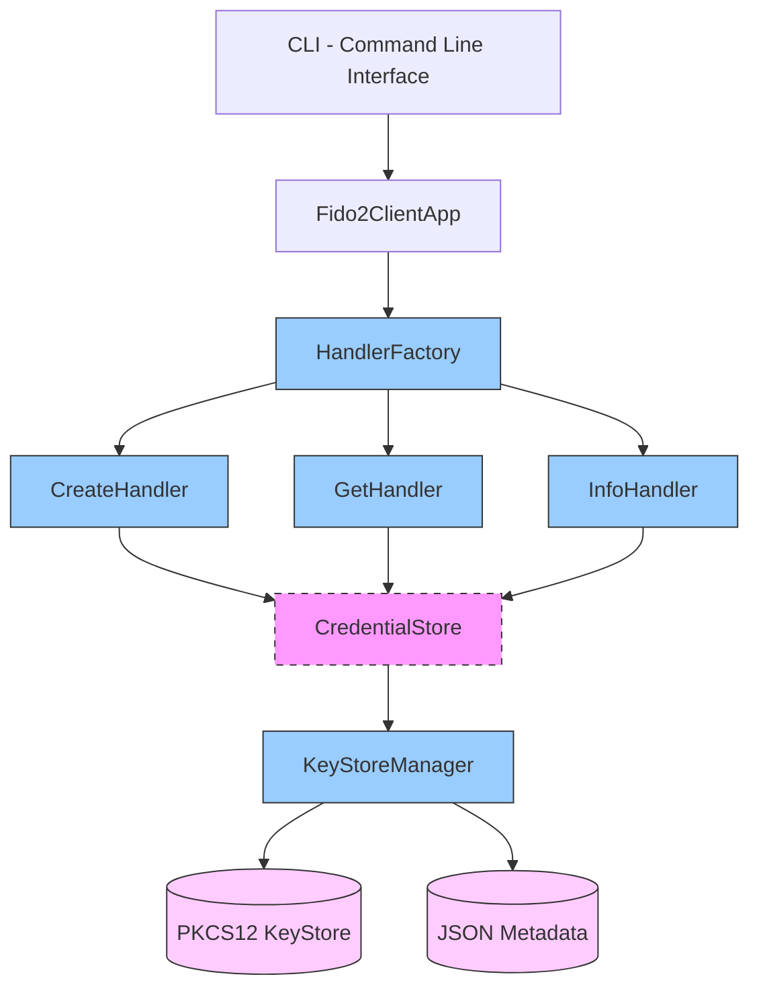
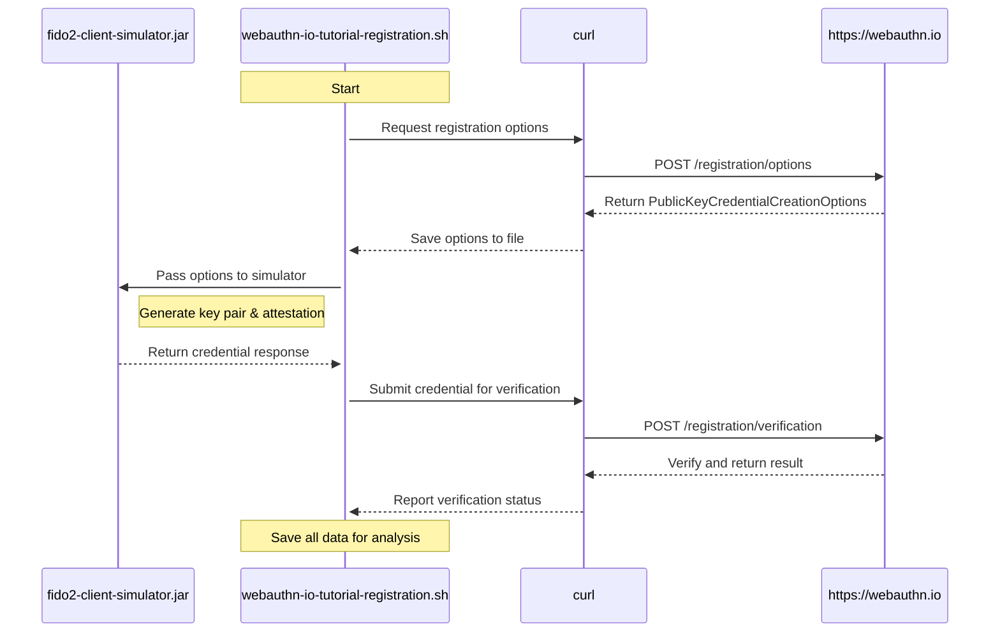
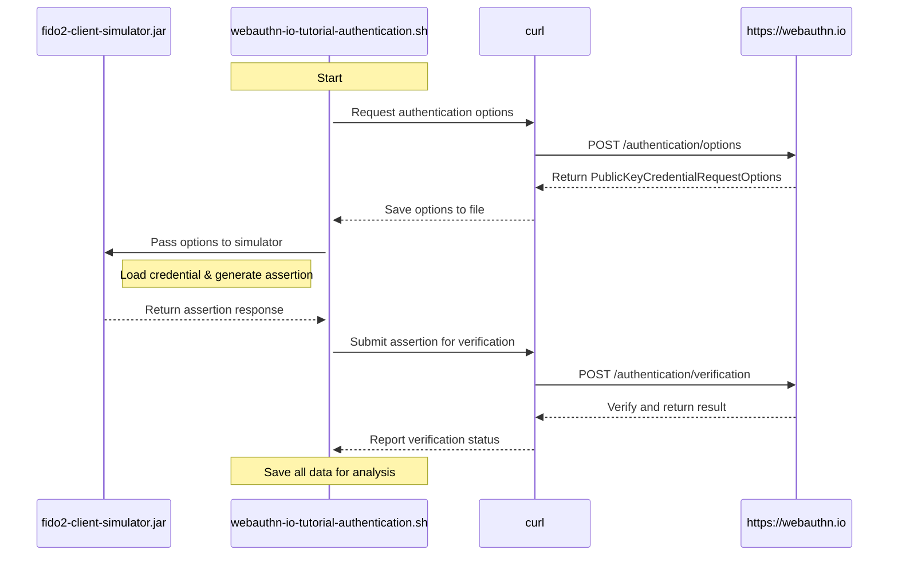

# FIDO2 Client Simulator

A Java command-line application that simulates a FIDO2 authenticator for registration (`create`) and authentication (`get`) flows, with enhanced debugging and interoperability features. Designed with modern architectural patterns and SOLID principles.

**Author:** Jordi Murgo (jordi.murgo@gmail.com)

## Table of Contents
- [Quick Start](#quick-start)
- [Features](#features)
- [CLI Reference](#cli-reference)
- [Usage Examples](#usage-examples)
- [Advanced Usage](#advanced-usage)
- [Configuration](#configuration)
- [Architecture](#architecture)
- [WebAuthn.io Integration Scripts](#webauthnio-integration-scripts)
- [Troubleshooting](#troubleshooting)
- [Contributing](#contributing)
- [Changelog](#changelog)
- [License](#license)

## Quick Start

### Prerequisites
- Java 11 or newer
- Maven

### Build & Run
```bash
# Build the project
mvn clean package

# Display information about the current credentials
java -jar target/fido2-client-simulator-1.1-SNAPSHOT.jar info --pretty

# Create a sample credential (using example file)
java -jar target/fido2-client-simulator-1.1-SNAPSHOT.jar create --input create_options.json --pretty
```

## Features

### Core Functionality
- Simulates `navigator.credentials.create()` and `navigator.credentials.get()`
- Input: JSON for `PublicKeyCredentialCreationOptions` (create) or `PublicKeyCredentialRequestOptions` (get)
- Output: JSON representing the FIDO2 `PublicKeyCredential` response

### Design Principles
- **SOLID architecture** with clean separation of concerns
- **Modern functional programming** with Optional, Stream API and lambdas
- Robust validation with defensive approach and elegant exception handling
- Structured logging with appropriate levels

### Advanced Features
- Enhanced metadata storage in JSON format with rich credential information
- PEM-encoded public key storage for improved interoperability
- Detailed attestation and authenticator data decoding for debugging
- Save output directly to file with `--output` option
- Pretty-print JSON output with `--pretty` option
- Detailed logging with `--verbose` option
- Clean JSON-only output with `--json-only` option for scripting

### Technologies
- **Key storage**: Java KeyStore (PKCS12) for secure credential operations
- **Cryptography**: BouncyCastle and Yubico's WebAuthn libraries
- **JSON Processing**: Jackson with CBOR support and custom deserializers
- **Codificación**: Soporte para Base64, Base64URL y formatos binarios
- **CLI**: Picocli for command-line processing
- **Logging**: SLF4J con implementación Logback

## CLI Reference

### Command Line Options

| Option | Short | Description |
|--------|-------|-------------|
| `--input <FILE>` | `-i` | Specify an input file containing JSON options |
| `--output <FILE>` | `-o` | Save the output to a specified file |
| `--pretty` | | Format the JSON output with indentation for better readability |
| `--verbose` | | Enable detailed logging and show extended information |
| `--json-only` | | Output only the JSON response (useful for scripting) |
| `--interactive` | | Enable interactive credential selection (for `get` operation) |
| `--format <FORMAT>` | `-f` | Output format (default, bytes, ints, ping) |
| `--help` | `-h` | Show help message |
| `--version` | `-V` | Print version information and exit |

### Operations

| Operation | Description |
|-----------|-------------|
| `create` | Simulates credential creation (registration) |
| `get` | Simulates credential usage (authentication) |
| `info` | Displays information about stored credentials |

## Usage Examples

### Input Methods

You can provide input to the CLI in three ways:

1. **Input file** (recommended for large/complex JSON):
   ```bash
   java -jar target/fido2-client-simulator-1.1-SNAPSHOT.jar <create|get> --input <input.json>
   ```

2. **Direct JSON string argument**:
   ```bash
   java -jar target/fido2-client-simulator-1.1-SNAPSHOT.jar <create|get> '{JSON data...}'
   ```

3. **Standard input (pipe or keyboard)**:
   ```bash
   cat input.json | java -jar target/fido2-client-simulator-1.1-SNAPSHOT.jar <create|get>
   ```

### Registration (`create`)

#### Basic Example
```bash
java -jar target/fido2-client-simulator-1.1-SNAPSHOT.jar create -i create_options.json -o response.json
```

#### Example with Custom Challenge and Format
```bash
java -jar target/fido2-client-simulator-1.1-SNAPSHOT.jar create -i create_options.json -f bytes --pretty
```

#### Example Input JSON
```json
{
  "challenge": "TEmqTQU6DhV2SaO0YFTM15KsqWyiFqpjHWa43HT7wBkKLNVQQttG5ADyRXjR8GZNFl8kexjNUKYwl6JF2MxHDA",
  "rp": {
    "name": "Example RP",
    "id": "example.com"
  },
  "user": {
    "id": "user123",
    "name": "user@example.com",
    "displayName": "Example User"
  },
  "pubKeyCredParams": [
    {"type": "public-key", "alg": -7},
    {"type": "public-key", "alg": -257}
  ],
  "timeout": 60000,
  "attestation": "direct",
  "authenticatorSelection": {
    "authenticatorAttachment": "platform",
    "requireResidentKey": false,
    "residentKey": "preferred",
    "userVerification": "preferred"
  }
}
```

### Authentication (`get`)

```bash
java -jar target/fido2-client-simulator-1.1-SNAPSHOT.jar get --input get_options.json
```

### Credential Store Information (`info`)

```bash
java -jar target/fido2-client-simulator-1.1-SNAPSHOT.jar info --pretty
```

## Debugging y Depuración

### Niveles de Log

Los niveles de log se pueden configurar en `logback.xml`. Los niveles disponibles son:
- `TRACE`: Muestra toda la información, incluyendo el procesamiento detallado de desafíos
- `DEBUG`: Información detallada de depuración
- `INFO`: Información general del flujo de la aplicación
- `WARN`: Advertencias de posibles problemas
- `ERROR`: Errores que requieren atención

### Ejemplo de Salida de Depuración

```
TRACE - Deserializando campo 'challenge' desde string base64url (88 caracteres)
DEBUG - Challenge bytes (hex): 4c49efbfbd4d053a0e157649...
DEBUG - Challenge base64url: TEnvv71NBToOFXZJ77-977-9YFTvv73Xku...
```

## Advanced Usage

### Output Formatting and File Redirection

#### Pretty-Print JSON Output
```bash
java -jar target/fido2-client-simulator-1.1-SNAPSHOT.jar create --input create_options.json --pretty
```

#### Save Output to File
```bash
java -jar target/fido2-client-simulator-1.1-SNAPSHOT.jar create --input create_options.json --output response.json
```

#### JSON-Only Response (for Scripting)
```bash
java -jar target/fido2-client-simulator-1.1-SNAPSHOT.jar create --input create_options.json --json-only
```

### Detailed Logging with Verbose Mode
```bash
java -jar target/fido2-client-simulator-1.1-SNAPSHOT.jar info --verbose --pretty
```

### Base64-Encoded Input Support
You can provide the input JSON as Base64-encoded content:
```bash
base64 -i create_options.json | java -jar target/fido2-client-simulator-1.1-SNAPSHOT.jar create
```

### Interactive Credential Selection
When using `get` with multiple available credentials:
```bash
java -jar target/fido2-client-simulator-1.1-SNAPSHOT.jar get --input get_options.json --interactive
```

### Attestation Object Decoding
During credential creation, the attestation object is automatically decoded and displayed.

### Output Formats

The simulator supports different output formats for binary data in the response. You can specify the format using the `--format` or `-f` option:

```bash
java -jar target/fido2-client-simulator-1.1-SNAPSHOT.jar create -i create_options.json -f bytes
```

#### Available Formats

| Format | Description |
|--------|-------------|
| `default` | Uses base64url for all binary fields |
| `bytes` | Outputs binary data as arrays of signed bytes (-128 to 127) |
| `ints` | Outputs binary data as arrays of unsigned integers (0-255) |
| `ping` | Optimized format for Ping Identity compatibility |

#### Format Configuration

Formats are defined in `src/main/resources/configuration.yaml`. Each format specifies how different fields should be encoded:

- `base64`: Standard Base64 encoding (with +/=)
- `base64url`: URL-safe Base64 encoding (with -_)
- `byteArray`: Array of signed bytes (-128 to 127)
- `intArray`: Array of unsigned integers (0-255)
- `string`: Try to decode as UTF-8 text (falls back to base64url if not valid)
- `number`: mantains the number as it is
- `object`: mantains the object as it is
- `null`: Sets the field to null (type `'null'` in the configuration)
- `remove`: Exclude the field from output

### Configuration

The simulator uses a YAML configuration file for format definitions and other settings. The default configuration is loaded from the classpath at `configuration.yaml`.

#### Configuration File Locations
The configuration is loaded from the following locations in order of precedence:

1. File specified by `FIDO2_CONFIG` environment variable
2. `config/configuration.yaml` in the current directory
3. `configuration.yaml` in the current directory
4. Default configuration from classpath

#### Example Configuration

```yaml
# Keystore settings
keystore:
  path: fido2_keystore.p12
  password: changeme
  metadataPath: fido2_keystore_metadata.json

# Logging level (DEBUG, INFO, WARN, ERROR)
logLevel: INFO

# Output formats configuration
formats:
  # Default format - uses base64url for binary fields (WebAuthn standard)
  default:
    id: base64url
    rawId: base64url
    authenticatorData: base64url
    clientDataJSON: base64url
    signature: base64url
    userHandle: base64url
    attestationObject: base64url
    publicKey: base64url
    
  # Bytes format - outputs binary data as signed byte arrays
  bytes:
    id: base64url
    rawId: byteArray
    authenticatorData: byteArray
    clientDataJSON: string
    signature: byteArray
    userHandle: base64url
    attestationObject: byteArray
    publicKey: byteArray
    
  # Ints format - outputs binary data as unsigned integers
  ints:
    id: base64url
    rawId: intArray
    authenticatorData: intArray
    clientDataJSON: string
    signature: intArray
    userHandle: base64url
    attestationObject: intArray
    publicKey: intArray
    
  # Ping format - optimized for Ping Identity compatibility
  ping:
    id: 'null'
    rawId: 'base64url'
    clientDataJSON: 'string'
    attestationObject: 'byteArray'
    authenticatorData: 'byteArray'
    publicKey: 'null'
    publicKeyAlgorithm: 'null'
    signature: 'byteArray'
    userHandle: 'null'
```

### Files Created

- `fido2_keystore.p12`: Stores credential private keys in PKCS12 format
- `fido2_keystore_metadata.json`: Stores credential metadata including:
  - Registration response JSON
  - RP (Relying Party) information
  - User information
  - Public key details
  - Creation timestamp
  - Credential ID and other metadata

## Architecture

### Component Diagram



### Implemented Design Patterns

#### 1. Repository Pattern (CredentialStore)
`CredentialStore` acts as an abstract repository for credential storage operations, decoupling business logic from the persistence mechanism.

#### 2. Factory Pattern (HandlerFactory)
Implementation of the Factory pattern for creating specific handlers.

#### 3. Strategy Pattern (Handlers)
The `CreateHandler`, `GetHandler`, and `InfoHandler` handlers implement different strategies for processing FIDO2 operations, sharing the common `CommandHandler` interface.

#### 4. Functional Programming and Optional
Use of modern functional programming techniques for more concise and safer code.

### Architecture Benefits

1. **Testability**: The use of interfaces facilitates testing with mocks.
2. **Extensibility**: New storage types can implement `CredentialStore`.
3. **Maintainability**: Clear separation of responsibilities.
4. **Security**: Robust exception handling and input validation.
5. **Evolution**: Facilitates the incorporation of new features without modifying existing code.

## WebAuthn.io Integration Scripts

The project includes two example scripts that demonstrate how to use FIDO2 Client Simulator with the WebAuthn.io demo site.

### WebAuthn.io Integration Diagrams

#### Registration Flow Sequence Diagram



#### Authentication Flow Sequence Diagram



## Troubleshooting

### Manejo de Desafíos (Challenges)

El simulador maneja automáticamente los desafíos durante el registro y autenticación. Si encuentras problemas:

1. **Formato del Challenge**:
   - Asegúrate de que el challenge esté en formato Base64URL
   - El simulador intentará decodificar automáticamente si está en otro formato

2. **Verificación del Challenge**:
   - Durante el registro, se valida que el challenge no se modifique
   - Se incluyen logs detallados con el prefijo `ByteArrayDeserializer` para depuración

3. **Logs de Depuración**:
   - Usa `--verbose` para ver información detallada del procesamiento
   - Los desafíos se registran en formato hexadecimal para facilitar la comparación

### Common Issues

- **KeyStore errors**: Ensure you have proper write permissions to the keystore directory.
- **Java version compatibility**: Confirm you're using Java 11 or newer.
- **JSON parsing errors**: Check for syntax errors in your input JSON files.
- **Missing credentials**: Use the `info` command to check available credentials.

### Diagnostic Tips

1. Use `--verbose` to get detailed logging and error information.
2. Examine the output of `info --verbose` to check credential status.
3. For attestation issues, review the decoded attestation object details.

## Contributing

Contributions are welcome! Please feel free to submit a Pull Request.

1. Fork the repository
2. Create your feature branch (`git checkout -b feature/amazing-feature`)
3. Commit your changes (`git commit -m 'Add some amazing feature'`)
4. Push to the branch (`git push origin feature/amazing-feature`)
5. Open a Pull Request

## Changelog

### [1.2.0] - 2025-05-19
- **Mejora**: Mejor manejo de desafíos (challenges) durante el registro
- **Nuevo**: Utilidades mejoradas de codificación/decodificación Base64
- **Depuración**: Logs más detallados para el seguimiento de desafíos
- **Rendimiento**: Optimización del procesamiento de JSON

### [1.1.0] - 2025-05-15(Current)
- Added support for `CommandHandler` interface replacing `CredentialHandler`
- Enhanced `info` command with detailed system configuration output
- Changed --file option to --input for consistency
- Improved error handling and documentation

### v1.0
- Initial release with core FIDO2 functionality
- Support for registration and authentication

## License

© 2025 Jordi Murgo (jordi.murgo@gmail.com). FIDO2 Client Simulator. MIT License.
