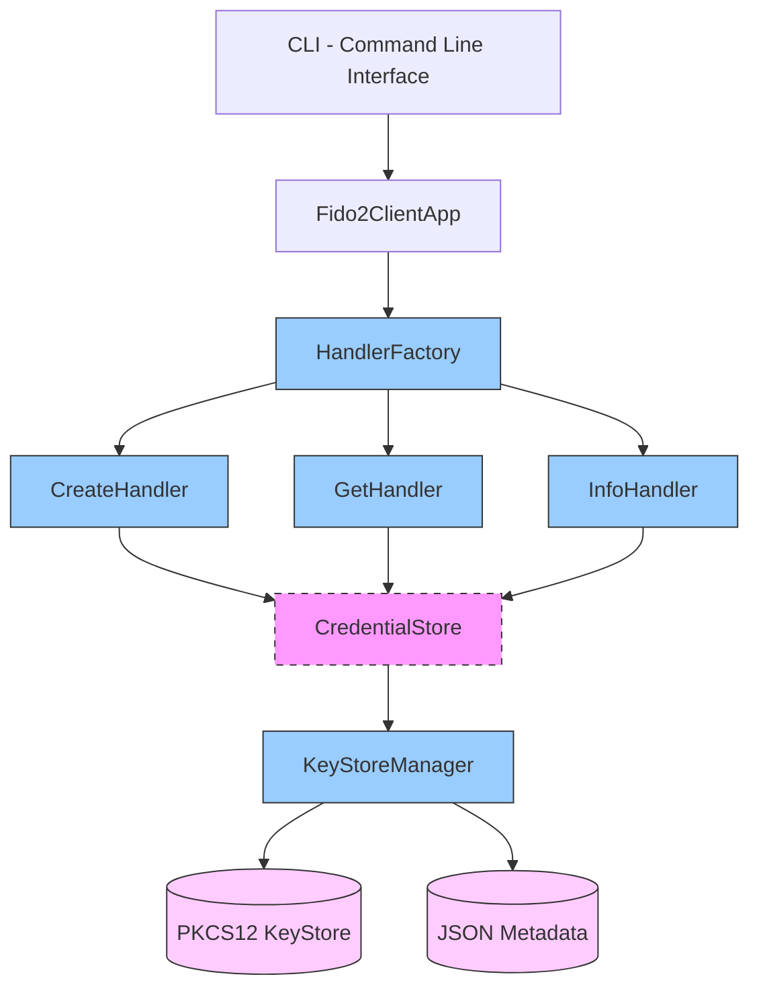
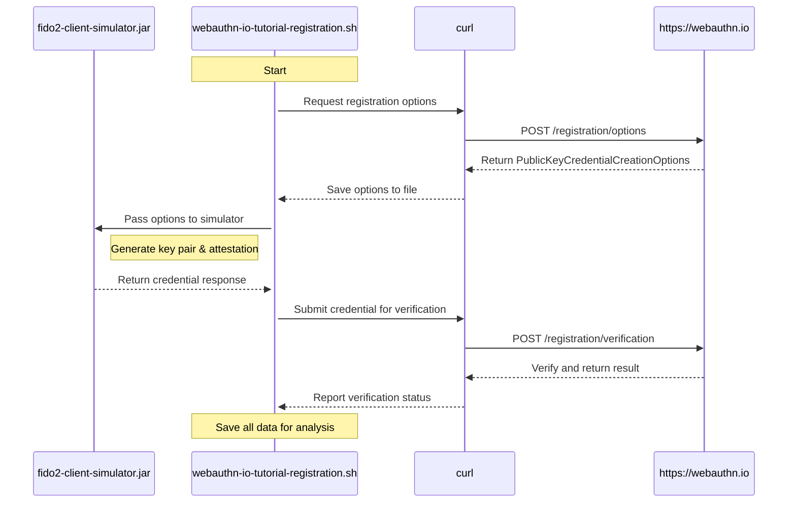
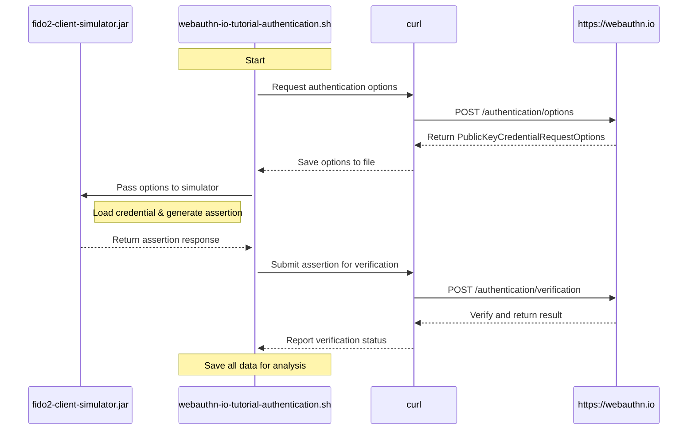

# FIDO2 Client Simulator

A Java command-line application that simulates a FIDO2 authenticator for registration (`create`) and authentication (`get`) flows, with enhanced debugging and interoperability features. Designed with modern architectural patterns and SOLID principles.

**Author:** Jordi Murgo (jordi.murgo@gmail.com)

## Table of Contents
- [Quick Start](#quick-start)
- [Features](#features)
- [CLI Reference](#cli-reference)
- [Usage Examples](#usage-examples)
- [Advanced Usage](#advanced-usage)
- [Configuration](#configuration)
- [Architecture](#architecture)
- [WebAuthn.io Integration Scripts](#webauthnio-integration-scripts)
- [Troubleshooting](#troubleshooting)
- [Contributing](#contributing)
- [Changelog](#changelog)
- [License](#license)

## Quick Start

### Prerequisites
- Java 11 or newer
- Maven

### Build & Run
```bash
# Build the project
mvn clean package

# Display information about the current credentials
java -jar target/fido2-client-simulator-1.1-SNAPSHOT.jar info --pretty

# Create a sample credential (using example file)
java -jar target/fido2-client-simulator-1.1-SNAPSHOT.jar create --input create_options.json --pretty
```

## Features

### Core Functionality
- Simulates `navigator.credentials.create()` and `navigator.credentials.get()`
- Input: JSON for `PublicKeyCredentialCreationOptions` (create) or `PublicKeyCredentialRequestOptions` (get)
- Output: JSON representing the FIDO2 `PublicKeyCredential` response

### Design Principles
- **SOLID architecture** with clean separation of concerns
- **Modern functional programming** with Optional, Stream API and lambdas
- Robust validation with defensive approach and elegant exception handling
- Structured logging with appropriate levels

### Advanced Features
- Enhanced metadata storage in JSON format with rich credential information
- PEM-encoded public key storage for improved interoperability
- Detailed attestation and authenticator data decoding for debugging
- Save output directly to file with `--output` option
- Pretty-print JSON output with `--pretty` option
- Detailed logging with `--verbose` option
- Clean JSON-only output with `--json-only` option for scripting

### Technologies
- **Key storage**: Java KeyStore (PKCS12) for secure credential operations
- **Cryptography**: Uses BouncyCastle and Yubico's WebAuthn libraries
- **JSON**: Uses Jackson with CBOR support
- **CLI**: Uses Picocli for command-line processing

## CLI Reference

### Command Line Options

| Option | Short | Description |
|--------|-------|-------------|
| `--input <FILE>` | `-i` | Specify an input file containing JSON options |
| `--output <FILE>` | `-o` | Save the output to a specified file |
| `--pretty` | | Format the JSON output with indentation for better readability |
| `--verbose` | | Enable detailed logging and show extended information |
| `--json-only` | | Output only the JSON response (useful for scripting) |
| `--interactive` | | Enable interactive credential selection (for `get` operation) |
| `--help` | | Show help message |

### Operations

| Operation | Description |
|-----------|-------------|
| `create` | Simulates credential creation (registration) |
| `get` | Simulates credential usage (authentication) |
| `info` | Displays information about stored credentials |

## Usage Examples

### Input Methods

You can provide input to the CLI in three ways:

1. **Input file** (recommended for large/complex JSON):
   ```bash
   java -jar target/fido2-client-simulator-1.1-SNAPSHOT.jar <create|get> --input <input.json>
   ```

2. **Direct JSON string argument**:
   ```bash
   java -jar target/fido2-client-simulator-1.1-SNAPSHOT.jar <create|get> '{JSON data...}'
   ```

3. **Standard input (pipe or keyboard)**:
   ```bash
   cat input.json | java -jar target/fido2-client-simulator-1.1-SNAPSHOT.jar <create|get>
   ```

### Registration (`create`)

```bash
java -jar target/fido2-client-simulator-1.1-SNAPSHOT.jar create --input create_options.json
```

### Authentication (`get`)

```bash
java -jar target/fido2-client-simulator-1.1-SNAPSHOT.jar get --input get_options.json
```

### Credential Store Information (`info`)

```bash
java -jar target/fido2-client-simulator-1.1-SNAPSHOT.jar info --pretty
```

## Advanced Usage

### Output Formatting and File Redirection

#### Pretty-Print JSON Output
```bash
java -jar target/fido2-client-simulator-1.1-SNAPSHOT.jar create --input create_options.json --pretty
```

#### Save Output to File
```bash
java -jar target/fido2-client-simulator-1.1-SNAPSHOT.jar create --input create_options.json --output response.json
```

#### JSON-Only Response (for Scripting)
```bash
java -jar target/fido2-client-simulator-1.1-SNAPSHOT.jar create --input create_options.json --json-only
```

### Detailed Logging with Verbose Mode
```bash
java -jar target/fido2-client-simulator-1.1-SNAPSHOT.jar info --verbose --pretty
```

### Base64-Encoded Input Support
You can provide the input JSON as Base64-encoded content:
```bash
base64 -i create_options.json | java -jar target/fido2-client-simulator-1.1-SNAPSHOT.jar create
```

### Interactive Credential Selection
When using `get` with multiple available credentials:
```bash
java -jar target/fido2-client-simulator-1.1-SNAPSHOT.jar get --input get_options.json --interactive
```

### Attestation Object Decoding
During credential creation, the attestation object is automatically decoded and displayed.

### Output Formats

The simulator supports different output formats for binary data in the response. You can specify the format using the `--format` option:

```bash
java -jar target/fido2-client-simulator-1.1-SNAPSHOT.jar create --input create_options.json --format=chrome
```

#### Available Formats

| Format | Description |
|--------|-------------|
| `default` | Uses base64url for all binary fields (WebAuthn standard) |
| `bytes` | Outputs binary data as arrays of signed bytes (-128 to 127) |
| `json` | Uses standard base64 for binary fields (better for some JSON tools) |
| `chrome` | Similar to Chrome's WebAuthn debug output |
| `debug` | All fields as arrays of integers (0-255) for easy inspection |
| `minimal` | Only includes essential fields with compact encoding |

#### Format Configuration

You can customize the output formats by editing the `fido2_formats.yaml` file in the resources directory. Each format can specify how different fields should be encoded.

Available encoding options for each field:
- `base64`: Standard Base64 encoding (with +/)
- `base64url`: URL-safe Base64 encoding (with -_)
- `bytearray` or `bytes`: Array of signed bytes (-128 to 127)
- `intarray` or `ints`: Array of unsigned integers (0-255)
- `string`: Try to decode as UTF-8 text (falls back to base64url if not valid text)

### Configuration

#### Configuration File Locations
The configuration is loaded from the following locations in order of precedence:

1. Current directory: `fido2_config.properties`
2. User home directory: `~/.fido2/config.properties`
3. System-wide: `/etc/fido2/config.properties`
4. Application classpath (default embedded configuration)

#### Available Configuration Properties

| Property | Description | Default Value |
|----------|-------------|---------------|
| `keystore.path` | Path to the PKCS12 keystore file | `fido2_keystore.p12` |
| `metadata.path` | Path to the JSON metadata file | `fido2_metadata.json` |
| `keystore.password` | Password for the keystore | `changeit` |
| `log.level` | Logging level | `INFO` |
| `default.format` | Default output format to use | `default` |

#### Sample Configuration

```properties
# Storage settings
keystore.path=/secure/path/fido2_keystore.p12
metadata.path=/secure/path/fido2_metadata.json

# Security settings
keystore.password=your_secure_password

# Logging configuration
log.level=INFO

# Default output format
default.format=chrome
```

### Files Created

- `fido2_keystore.p12`: Stores credential private keys in PKCS12 format
- `fido2_metadata.json`: Stores rich credential metadata including:
  - Registration response JSON
  - RP information
  - User information
  - PEM-encoded public key
  - Creation timestamp

## Architecture

### Component Diagram



### Implemented Design Patterns

#### 1. Repository Pattern (CredentialStore)
`CredentialStore` acts as an abstract repository for credential storage operations, decoupling business logic from the persistence mechanism.

#### 2. Factory Pattern (HandlerFactory)
Implementation of the Factory pattern for creating specific handlers.

#### 3. Strategy Pattern (Handlers)
The `CreateHandler`, `GetHandler`, and `InfoHandler` handlers implement different strategies for processing FIDO2 operations, sharing the common `CommandHandler` interface.

#### 4. Functional Programming and Optional
Use of modern functional programming techniques for more concise and safer code.

### Architecture Benefits

1. **Testability**: The use of interfaces facilitates testing with mocks.
2. **Extensibility**: New storage types can implement `CredentialStore`.
3. **Maintainability**: Clear separation of responsibilities.
4. **Security**: Robust exception handling and input validation.
5. **Evolution**: Facilitates the incorporation of new features without modifying existing code.

## WebAuthn.io Integration Scripts

The project includes two example scripts that demonstrate how to use FIDO2 Client Simulator with the WebAuthn.io demo site.

### WebAuthn.io Integration Diagrams

#### Registration Flow Sequence Diagram



#### Authentication Flow Sequence Diagram



## Troubleshooting

### Common Issues

- **KeyStore errors**: Ensure you have proper write permissions to the keystore directory.
- **Java version compatibility**: Confirm you're using Java 11 or newer.
- **JSON parsing errors**: Check for syntax errors in your input JSON files.
- **Missing credentials**: Use the `info` command to check available credentials.

### Diagnostic Tips

1. Use `--verbose` to get detailed logging and error information.
2. Examine the output of `info --verbose` to check credential status.
3. For attestation issues, review the decoded attestation object details.

## Contributing

Contributions are welcome! Please feel free to submit a Pull Request.

1. Fork the repository
2. Create your feature branch (`git checkout -b feature/amazing-feature`)
3. Commit your changes (`git commit -m 'Add some amazing feature'`)
4. Push to the branch (`git push origin feature/amazing-feature`)
5. Open a Pull Request

## Changelog

### v1.1 (Current)
- Added support for `CommandHandler` interface replacing `CredentialHandler`
- Enhanced `info` command with detailed system configuration output
- Changed --file option to --input for consistency
- Improved error handling and documentation

### v1.0
- Initial release with core FIDO2 functionality
- Support for registration and authentication

## License

© 2025 Jordi Murgo (jordi.murgo@gmail.com). FIDO2 Client Simulator. MIT License.
