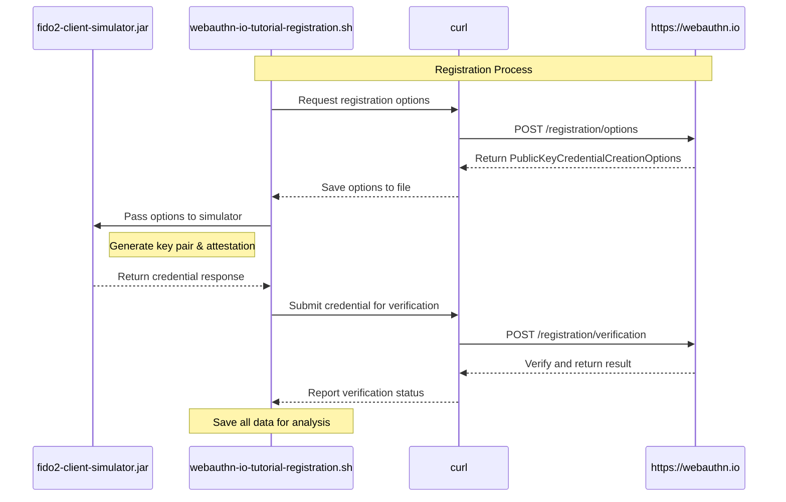
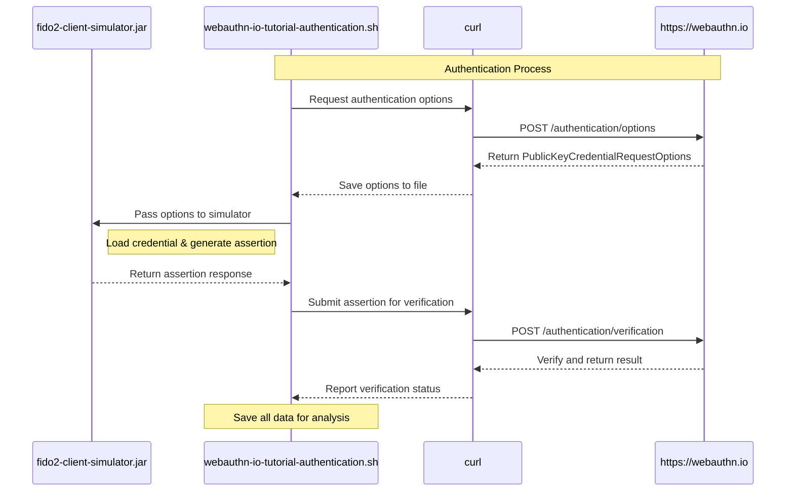

# FIDO2 Client Simulator

A Java command-line application that simulates a FIDO2 authenticator for registration (`create`) and authentication (`get`) flows, with enhanced debugging and interoperability features.

**Author:** Jordi Murgo (jordi.murgo@gmail.com)

## Features
- Simulates `navigator.credentials.create()` and `navigator.credentials.get()`
- Input: JSON for `PublicKeyCredentialCreationOptions` (create) or `PublicKeyCredentialRequestOptions` (get)
- Output: JSON representing the FIDO2 `PublicKeyCredential` response
- Enhanced metadata storage in JSON format with rich credential information
- PEM-encoded public key storage for improved interoperability
- Detailed attestation and authenticator data decoding for debugging
- Save output directly to file with `--output` option
- Pretty-print JSON output with `--pretty` option
- Detailed logging with `--verbose` option
- Clean JSON-only output with `--json-only` option for scripting
- Key storage: Java KeyStore (PKCS12) for secure credential operations
- Crypto: Uses BouncyCastle and Yubico's WebAuthn libraries
- JSON: Uses Jackson with CBOR support
- CLI: Uses Picocli

## Build Instructions

1. **Install prerequisites:**
   - Java 11 or newer
   - Maven

2. **Build the project:**
   ```bash
   mvn clean package
   ```
   This will produce a fat JAR at `target/fido2-client-simulator-1.0-SNAPSHOT.jar`.

## CLI Usage

### Command-Line Options

The FIDO2 Client Simulator supports the following command-line options:

| Option | Description |
|--------|-------------|
| `--file`, `-f` | Specify an input file containing JSON options |
| `--output`, `-o` | Save the output to a specified file |
| `--pretty` | Format the JSON output with indentation for better readability |
| `--verbose` | Enable detailed logging for debugging |
| `--json-only` | Output only the JSON response (useful for scripting) |
| `--interactive` | Enable interactive credential selection |
| `--help` | Show help message |

### Input Methods

You can provide input to the CLI in three ways:

1. **Input file** (recommended for large/complex JSON):
   ```bash
   java -jar target/fido2-client-simulator-1.0-SNAPSHOT.jar <create|get> --file <input.json>
   ```
   Example:
   ```bash
   java -jar target/fido2-client-simulator-1.0-SNAPSHOT.jar create --file create_options.json
   ```

2. **Direct JSON string argument**:
   ```bash
   java -jar target/fido2-client-simulator-1.0-SNAPSHOT.jar <create|get> '{"challenge": "...", ...}'
   ```
   Example:
   ```bash
   java -jar target/fido2-client-simulator-1.0-SNAPSHOT.jar get '{"challenge": "BBBB...", "rpId": "localhost", ...}'
   ```

3. **Standard Input (stdin)** (if neither --file nor JSON string is given):
   ```bash
   java -jar target/fido2-client-simulator-1.0-SNAPSHOT.jar <create|get>
   # Paste or pipe your JSON, then press Ctrl+D (Unix) or Ctrl+Z (Windows) to finish
   ```
   Example:
   ```bash
   echo '{"challenge": "CCCC...", "rpId": "localhost", ...}' | java -jar target/fido2-client-simulator-1.0-SNAPSHOT.jar get
   ```

### Base64-Encoded Input Support

You can also provide the input JSON as Base64-encoded content. The application will automatically attempt to decode Base64 (both standard and URL-safe variants) before processing the JSON:

```bash
# Create a Base64-encoded version of your input file
base64 -i create_options.json | java -jar target/fido2-client-simulator-1.0-SNAPSHOT.jar create
```

This is useful when:
- Working with WebAuthn implementations that encode their options as Base64
- Exchanging options between systems where Base64 encoding is preferred
- Passing complex JSON through environments that might interfere with JSON formatting

The application tries the following decodings in sequence:
1. Base64 URL-safe decoding
2. Standard Base64 decoding
3. Fallback to using the input as-is (plain JSON)

---

### Registration (`create`)

**Example input (`create_options.json`):**
```json
{
  "rp": {
    "name": "My Test RP",
    "id": "localhost"
  },
  "user": {
    "name": "testuser",
    "displayName": "Test User",
    "id": "dGVzdHVzZXJfaWQ="
  },
  "challenge": "AAAAAAAAAAAAAAAAAAAAAA",
  "pubKeyCredParams": [
    { "type": "public-key", "alg": -7 },
    { "type": "public-key", "alg": -257 }
  ],
  "authenticatorSelection": {
    "userVerification": "discouraged"
  },
  "attestation": "packed"
}
```

**Run registration (with file):**
```bash
java -jar target/fido2-client-simulator-1.0-SNAPSHOT.jar create --file create_options.json
```

**Run registration (via stdin):**
```bash
cat create_options.json | java -jar target/fido2-client-simulator-1.0-SNAPSHOT.jar create
```

### Authentication (`get`)

**Example input (`get_options.json`):**
```json
{
  "challenge": "BBBBBBBBBBBBBBBBBBBBBB",
  "rpId": "localhost",
  "allowCredentials": [
    {
      "type": "public-key",
      "id": "<CredentialID-from-create-response>"
    }
  ],
  "userVerification": "discouraged"
}
```

**Run authentication (with file):**
```bash
java -jar target/fido2-client-simulator-1.0-SNAPSHOT.jar get --file get_options.json
```

**Run authentication (direct JSON string):**
```bash
java -jar target/fido2-client-simulator-1.0-SNAPSHOT.jar get '{
  "challenge": "BBBBBBBBBBBBBBBBBBBBBB",
  "rpId": "localhost",
  "allowCredentials": [
    { "type": "public-key", "id": "<CredentialID-from-create-response>" }
  ],
  "userVerification": "discouraged"
}'
```

**Run authentication (stdin):**
```bash
cat get_options.json | java -jar target/fido2-client-simulator-1.0-SNAPSHOT.jar get
```
# or
```bash
java -jar target/fido2-client-simulator-1.0-SNAPSHOT.jar get
# (paste JSON, then Ctrl+D)
```

---

### Arguments Supported by `get` (Authentication)

The `get` command simulates the FIDO2 authentication (assertion) process and supports the following input arguments (as JSON):

- `challenge` (required): Random challenge from the server.
- `rpId` (required): Relying Party identifier (e.g., `localhost`).
- `allowCredentials` (optional): List of credential descriptors to allow. If omitted, all credentials for the given `rpId` are considered.
- `userVerification` (optional): Can be `required`, `preferred`, or `discouraged`.
- `timeout` (optional): Timeout in milliseconds.
- `extensions` (optional): Extensions for additional features (e.g., `{ "uvm": true }`).

#### Credential Selection Logic (when `allowCredentials` is not provided)

When the input JSON for authentication **does not** include `allowCredentials`, the simulator will:

- **Search for all credentials stored for the given `rpId`.**
    - If only one credential exists, it is used automatically.
    - If multiple credentials exist:
        - By default (non-interactive), the first credential is used automatically and a warning is printed to notify the user.
        - If you add `--interactive`, the CLI will prompt you to select which credential to use among those available for the specified `rpId`.

This behavior matches modern authenticator implementations and enables both automated and manual testing workflows.

#### Example: Authentication without `allowCredentials` array

Suppose you have the following input file (`get_options_notcredentials.json`):

```json
{
  "challenge": "BBBBBBBBBBBBBBBBBBBBBB",
  "rpId": "localhost",
  "userVerification": "required",
  "timeout": 60000,
  "extensions": {
    "uvm": true
  }
}
```

You can run the authentication as follows:

```bash
java -jar target/fido2-client-simulator-1.0-SNAPSHOT.jar get --file get_options_notcredentials.json
```

- If only one credential exists for `localhost`, it will be used.
- If multiple credentials exist for `localhost`, the first will be chosen by default, or you can use `--interactive` to select one:

```bash
java -jar target/fido2-client-simulator-1.0-SNAPSHOT.jar get --file get_options_notcredentials.json --interactive
```

#### Enhanced Interactive Credential Selection

When using the `--interactive` flag, the simulator displays a formatted table showing available credentials with user information:

```
[INFO] Multiple credentials found for rpId 'localhost':
--------------------------------------------------------------
  IDX | CREDENTIAL ID                  | USER INFO
--------------------------------------------------------------
  [0] | 50vs7QTXQjWwPKmtRvdUqA         | testuser (Test User)
  [1] | nEb4vWGvTBeRCuwic_BtcA         | testuser (Test User)
  [2] | T4qVPp9NQN6iVX5cCZRgtg         | testuser (Test User)
--------------------------------------------------------------
Select credential index: 2
[INFO] Selected credential: T4qVPp9NQN6iVX5cCZRgtg
```

This enhanced display:
- Shows each credential ID in a readable format (truncated if too long)
- Displays the user name and display name associated with each credential
- Makes it easy to identify the correct credential when multiple are available
- Especially useful in multi-user environments where different users have registered credentials on the same device

You can select the desired credential by entering its index number.

#### Summary Table: Credential Selection

| Scenario                              | Behavior                                                  |
|---------------------------------------|-----------------------------------------------------------|
| `allowCredentials` present            | Only listed credentials are eligible for assertion        |
| `allowCredentials` missing, 1 present | That credential is used automatically                     |
| `allowCredentials` missing, >1 present| First credential used (default), or prompt with `--interactive` |

#### Notes
- The simulator always filters credentials by the provided `rpId`.
- The selection logic is designed for both scripting (automatic) and manual (interactive) use cases.
- For advanced debugging, enable verbose logging or inspect the metadata output for credential details.

**This flexible behavior ensures the simulator is realistic and suitable for both automated CI and manual QA workflows.**

## Files
- `fido2_keystore.p12`: Stores credential private keys in PKCS12 format
- `fido2_metadata.json`: Stores rich credential metadata including:
  - Registration response JSON
  - RP information
  - User information
  - PEM-encoded public key
  - Creation timestamp

## Advanced Features

### Output Formatting and Saving

#### Pretty-Print JSON Output

Use the `--pretty` option to format the JSON output with proper indentation for better readability:

```bash
java -jar target/fido2-client-simulator-1.0-SNAPSHOT.jar create --file create_options.json --pretty
```

This produces nicely formatted JSON that's easier to read and analyze:

```json
{
  "id" : "afdwmPF5T7yBNPUd4DP1Ow",
  "response" : {
    "attestationObject" : "o2NmbXRkbm9uZWdhdHRTdG10oGhhdXRoRGF0YViUSZYN5YgOjGh0NBcPZHZgW4_krrmihjLHmVzzuoMdl2NBAAAAAAAAAAAAAAAAAAAAAAAAAAAAECC_99reuEKrrQajsYFOtsGlAQIDJiABIVggxzbUxC0ZA_vVO2kz0WqO9SnbbmEaqOvuoy14cyyL3HYiWCAUsdMw3-wlwJP7YoJPXFOoE0d6oGQa1OTHjBJgXiTODg",
    "clientDataJSON" : "ewogICJ0eXBlIiA6ICJ3ZWJhdXRobi5jcmVhdGUiLAogICJjaGFsbGVuZ2UiIDogIlkyaGhiR3hsYm1kbCIsCiAgIm9yaWdpbiIgOiAiaHR0cHM6Ly9sb2NhbGhvc3QiCn0",
    "transports" : [ ]
  },
  "authenticatorAttachment" : null,
  "clientExtensionResults" : {
    "appidExclude" : null,
    "credProps" : null,
    "largeBlob" : null
  },
  "type" : "public-key"
}
```

#### Save Output to File

Use the `--output` (or `-o`) option to save the JSON output directly to a file:

```bash
java -jar target/fido2-client-simulator-1.0-SNAPSHOT.jar create --file create_options.json --output result.json
```

This is particularly useful for:
- Saving results for later analysis
- Integrating with automated testing pipelines
- Creating documentation examples

You can combine this with `--pretty` for nicely formatted saved output:

```bash
java -jar target/fido2-client-simulator-1.0-SNAPSHOT.jar create --file create_options.json --pretty --output result.json
```

#### JSON-Only Mode for Scripting

Use the `--json-only` option to output only the JSON response without any additional logging or information:

```bash
java -jar target/fido2-client-simulator-1.0-SNAPSHOT.jar create --file create_options.json --json-only
```

This is ideal for:
- Scripting and automation
- Piping output to other tools
- CI/CD integration

### Verbose Logging

Enable detailed logging with the `--verbose` option to see more information about the credential creation or assertion process:

```bash
java -jar target/fido2-client-simulator-1.0-SNAPSHOT.jar get --file get_options.json --verbose
```

Verbose output includes:
- Detailed information about credential selection
- Debugging information for attestation and assertion
- Step-by-step processing information
- Error details when problems occur

Example verbose output:
```
[INFO] Checking 1 credentials from allowCredentials list
[DEBUG] Checking credential #0: U5HoKUR1ToCH1UeXiUXrKA
[INFO] Using credential: U5HoKUR1ToCH1UeXiUXrKA (position 0 in allowCredentials list)
...
```

### PEM-Encoded Public Key Storage
Each credential's public key is stored in standard PEM format (X.509 SubjectPublicKeyInfo) in the metadata, enabling:
- Easy interoperability with other systems and languages
- Direct use for signature verification without accessing the keystore
- Standard format for cryptographic operations

### Attestation Object Decoding
During credential creation, the attestation object is automatically decoded and displayed:
```
=== AttestationObject (decoded) ===
fmt: "none"
authData (base64): [base64-encoded-auth-data]

--- AuthData Structure ---
rpIdHash: [hex-encoded-hash]
flags: 0x45 (UP=1, UV=1, AT=1, ED=0)
signCount: 0
aaguid: 00000000-0000-0000-0000-000000000000
credentialIdLength: 16
credentialId: [base64url-encoded-id]
credentialPublicKey: [cbor-encoded-key-preview]
------------------------
attStmt: {}
```

This detailed decoding helps with:
- Debugging WebAuthn flows
- Understanding the internal structure of credentials
- Verifying correct flag settings and credential data

## WebAuthn.io Example Scripts

The project includes two example scripts that demonstrate how to use FIDO2 Client Simulator with the WebAuthn.io demo site. These scripts provide a complete end-to-end demonstration of both registration and authentication flows.

### WebAuthn.io Integration Diagrams

#### Registration Flow Sequence Diagram



#### Authentication Flow Sequence Diagram



### Registration Script (webauthn-io-tutorial-registration.sh)

This script demonstrates a complete FIDO2 registration flow with webauthn.io:

1. **Fetch Registration Options**: Uses curl to request registration options from webauthn.io
2. **Create Credential**: Passes the options to fido2-client-simulator to create a new credential
3. **Verify Registration**: Submits the credential back to webauthn.io for verification

To run the script:
```bash
./webauthn-io-tutorial-registration.sh
```

The script outputs detailed information about each step of the process and saves all request/response data in the `target/webauthn-io-tutorial` directory for later analysis.

### Authentication Script (webauthn-io-tutorial-authentication.sh)

This script demonstrates a complete FIDO2 authentication flow with webauthn.io:

1. **Fetch Authentication Options**: Uses curl to request authentication options from webauthn.io
2. **Generate Assertion**: Passes the options to fido2-client-simulator to generate an assertion
3. **Verify Authentication**: Submits the assertion back to webauthn.io for verification

To run the script:
```bash
./webauthn-io-tutorial-authentication.sh
```

**Note**: You should run the registration script first to create a credential before running the authentication script.

### Flow Breakdown

#### Registration Flow:
1. Script sends a request to webauthn.io for registration options
2. webauthn.io responds with PublicKeyCredentialCreationOptions
3. fido2-client-simulator receives the options and creates a credential
4. Script sends the credential back to webauthn.io for verification
5. webauthn.io verifies the credential and confirms success

#### Authentication Flow:
1. Script sends a request to webauthn.io for authentication options
2. webauthn.io responds with PublicKeyCredentialRequestOptions
3. fido2-client-simulator receives the options and generates an assertion
4. Script sends the assertion back to webauthn.io for verification
5. webauthn.io verifies the assertion and confirms success

### Benefits of Using These Scripts

- Demonstrates real-world FIDO2 flows with a public WebAuthn demo site
- Shows how to integrate the simulator with web applications
- Provides examples of handling JSON data between different components
- Useful for learning WebAuthn/FIDO2 protocols and debugging issues
- All intermediate files are saved for inspection and analysis

## Notes
- Change the keystore password in production!
- The default AAGUID is all zeros (software authenticator)
- For best results with scripting, use the `--json-only` option
- When debugging, combine `--pretty` and `--verbose` options
- See the code for more details and documentation

---

© 2025 Jordi Murgo (jordi.murgo@gmail.com). FIDO2 Client Simulator. MIT License.
