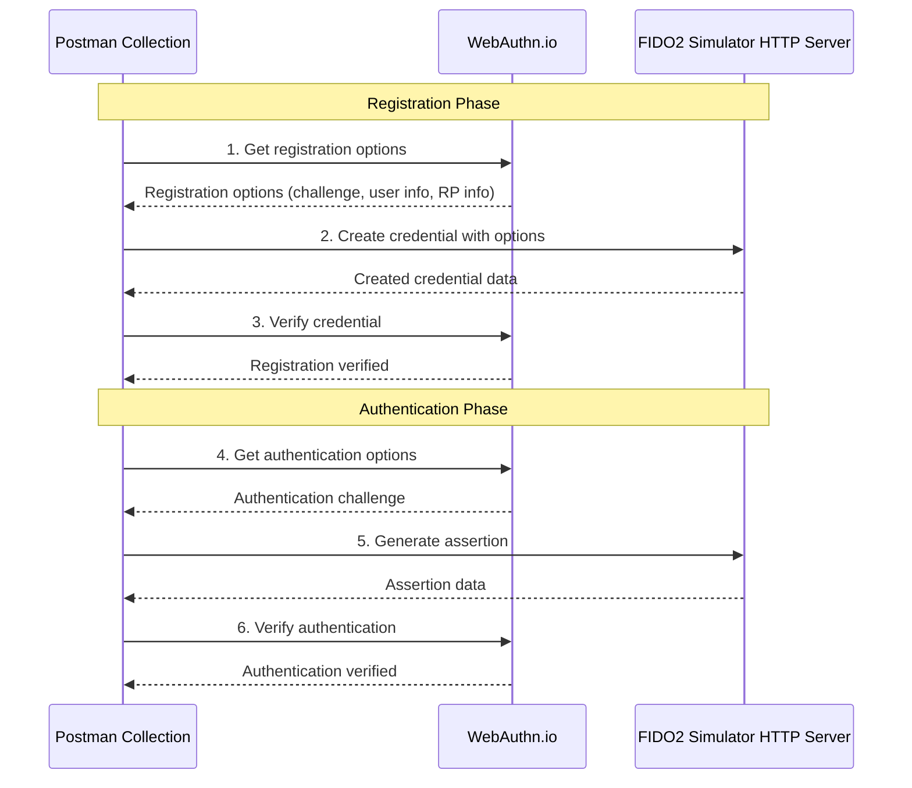

# WebAuthn.io Integration Guide

This guide explains how to use the Postman collection to integrate our FIDO2 Client Simulator HTTP server with webauthn.io to perform complete registration and authentication flows.

## Integration Architecture



## Complete Workflow

### Phase 1: Credential Registration

1. **Get WebAuthn.io Registration Options**
   - Request to webauthn.io to obtain registration options
   - Includes challenge, user info, RP info, etc.
   - Stores options in environment variables

2. **Create Credential via HTTP Server**
   - Sends webauthn.io options to our HTTP server
   - Our server creates the FIDO2 credential
   - Stores the credential for later verification

3. **Verify Registration with WebAuthn.io**
   - Sends the created credential back to webauthn.io
   - webauthn.io verifies and accepts the credential
   - Completes the registration

### Phase 2: Authentication

4. **Get WebAuthn.io Authentication Options**
   - Request to webauthn.io to obtain authentication challenge
   - Includes allowCredentials for the registered credential

5. **Generate Assertion via HTTP Server**
   - Sends authentication options to our HTTP server
   - Our server generates the assertion using the credential

6. **Verify Authentication with WebAuthn.io**
   - Sends the assertion to webauthn.io for verification
   - webauthn.io verifies the assertion and confirms authentication

## Automatic JavaScript Scripts

### Pre-request Scripts

Each request includes scripts that:

- Verify that necessary variables are available
- Automatically prepare payloads using data from previous requests
- Provide detailed logging

Example script from "Create Credential via HTTP Server":

```javascript
// Get registration options from previous request
var regOptions = pm.environment.get("webauthn_registration_options");
if (!regOptions) {
    throw new Error("No registration options found. Please run 'Get WebAuthn.io Registration Options' first.");
}

// Set the body to the registration options
pm.request.body.raw = regOptions;
```

### Test Scripts

Each response includes scripts that:

- Validate HTTP status codes
- Verify JSON response structure
- Extract and store important data
- Provide detailed result logging

Example registration verification script:

```javascript
pm.test("Registration verification successful", function () {
    var jsonData = pm.response.json();
    // WebAuthn.io may return different success indicators
    var isSuccess = jsonData.success === true || 
                   jsonData.verified === true || 
                   !jsonData.hasOwnProperty('error');
    
    pm.expect(isSuccess).to.be.true;
    console.log("Registration verified successfully on webauthn.io!");
});
```

## Managed Environment Variables

The collection automatically manages these variables:

| Variable | Purpose | Phase |
|----------|---------|-------|
| `webauthn_registration_options` | Registration options from webauthn.io | Registration |
| `webauthn_credential` | Credential created by our server | Registration |
| `webauthn_credential_id` | Credential ID | Registration |
| `webauthn_auth_options` | Authentication options from webauthn.io | Authentication |
| `webauthn_assertion` | Assertion generated by our server | Authentication |

## Prerequisites

1. **HTTP Server running**:

   ```bash
   java -jar target/fido2-client-simulator-1.3.0-SNAPSHOT.jar --listen 8080
   ```

   To verify the server is running, you can use:

   ```bash
   curl http://localhost:8080/info
   ```

2. **Internet connection** to communicate with webauthn.io

3. **Postman** with JavaScript scripting support

## Step-by-Step Execution

### Method 1: Manual Execution

1. Open the collection in Postman
2. Navigate to the "WebAuthn.io Integration" folder
3. Execute each request in sequential order (1 → 2 → 3 → 4 → 5 → 6)
4. Observe the logs in the Postman console

### Method 2: Collection Runner

1. Select the "WebAuthn.io Integration" folder
2. Click "Run collection"
3. Configure to run all requests in order
4. Review the runner results

## Result Verification

### Successful Registration

```
✓ Status code is 200
✓ Response contains registration options
✓ Store registration options
✓ Status code is 200
✓ Response contains credential data
✓ Store credential for verification
✓ Status code is 200
✓ Registration verification successful
```

### Successful Authentication

```
✓ Status code is 200
✓ Response contains authentication options
✓ Store authentication options
✓ Status code is 200
✓ Response contains assertion data
✓ Store assertion for verification
✓ Status code is 200
✓ Authentication verification successful
```

## Troubleshooting

### Error: "No registration options found"

**Cause**: First request was not executed or failed
**Solution**: Run "Get WebAuthn.io Registration Options" first

### Error: "HTTP server is not running"

**Cause**: FIDO2 server is not running
**Solution**:

```bash
java -jar target/fido2-client-simulator-1.3.0-SNAPSHOT.jar --listen 8080
```

### Verification error on webauthn.io

**Cause**: Possible network issues or data format problems
**Solution**:

- Verify internet connection
- Review logs in Postman console
- Execute the flow from the beginning

### Timeout on webauthn.io requests

**Cause**: Network latency or rate limiting
**Solution**:

- Increase timeout in Postman
- Wait a few seconds between requests
- Check webauthn.io status

## Alternative Test Script

To verify the flow works without Postman, use the test script:

```bash
./scripts/test-webauthn-io-postman-flow.sh
```

This script simulates exactly what the Postman collection does but using curl.

## Use Cases

This integration is useful for:

1. **Automated testing** of complete FIDO2 flows
2. **Validation** of compatibility with real WebAuthn services
3. **Demonstration** of simulator capabilities
4. **Development** of integrations with other WebAuthn platforms
5. **CI/CD** pipelines using Newman

## Customization

You can modify payloads to test different scenarios:

- Change `username` in requests
- Modify `user_verification` requirements
- Test different `authenticatorAttachment` values
- Adjust cryptographic algorithms in `algorithms`

The flexibility of Postman and JavaScript allows creating complex variations of the base flow.
